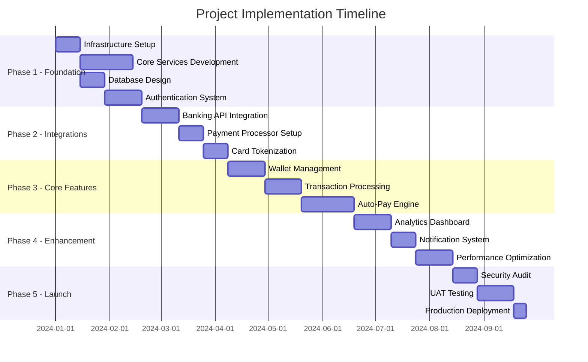

# Credit Card Auto-Payment System - Technical Design Document

## 1. Executive Summary

### 1.1 Project Overview
The Credit Card Auto-Payment System is a comprehensive financial management platform that automates credit card expense tracking and bill payments. The system acts as an intermediary between users' bank accounts and credit cards, providing seamless expense management through an in-house wallet system.

### 1.2 Core Objectives
- Automate credit card expense tracking in real-time
- Provide secure wallet-based payment management
- Ensure automatic bill payments without user intervention
- Maintain complete transaction transparency and audit trails
- Achieve PCI DSS Level 1 compliance for payment processing

### 1.3 Key Features
- Secure credit card linking with tokenization
- Automated bank-to-wallet transfers
- Real-time expense tracking
- Intelligent bill payment scheduling
- Comprehensive spending analytics
- Multi-factor authentication and fraud prevention

## 2. System Architecture

### 2.1 Architecture Overview

```
┌─────────────────────────────────────────────────────────────────┐
│                         Client Layer                             │
│  ┌─────────────┐  ┌─────────────┐  ┌─────────────┐             │
│  │   Web App   │  │ Mobile App  │  │   Admin     │             │
│  │   (React)   │  │ (iOS/Android)│ │   Portal    │             │
│  └─────────────┘  └─────────────┘  └─────────────┘             │
└─────────────────────────────────────────────────────────────────┘
                              │
                              ▼
┌─────────────────────────────────────────────────────────────────┐
│                      API Gateway Layer                           │
│  ┌──────────────────────────────────────────────────────────┐  │
│  │  Kong/AWS API Gateway                                    │  │
│  │  • Rate Limiting  • Auth  • Routing  • Load Balancing   │  │
│  └──────────────────────────────────────────────────────────┘  │
└─────────────────────────────────────────────────────────────────┘
                              │
                              ▼
┌─────────────────────────────────────────────────────────────────┐
│                    Microservices Layer                           │
│  ┌──────────┐ ┌──────────┐ ┌──────────┐ ┌──────────┐          │
│  │   Auth   │ │   User   │ │  Wallet  │ │  Credit  │          │
│  │ Service  │ │  Service │ │ Service  │ │   Card   │          │
│  └──────────┘ └──────────┘ └──────────┘ └──────────┘          │
│  ┌──────────┐ ┌──────────┐ ┌──────────┐ ┌──────────┐          │
│  │ Payment  │ │   Bill   │ │Analytics │ │  Notif.  │          │
│  │ Gateway  │ │ Payment  │ │ Service  │ │ Service  │          │
│  └──────────┘ └──────────┘ └──────────┘ └──────────┘          │
└─────────────────────────────────────────────────────────────────┘
                              │
                              ▼
┌─────────────────────────────────────────────────────────────────┐
│                       Data Layer                                 │
│  ┌────────────┐  ┌────────────┐  ┌────────────┐               │
│  │ PostgreSQL │  │   Redis    │  │  MongoDB   │               │
│  │  (Primary) │  │   (Cache)  │  │  (Logs)    │               │
│  └────────────┘  └────────────┘  └────────────┘               │
│  ┌────────────────────────────────────────────┐                │
│  │         Apache Kafka (Event Bus)           │                │
│  └────────────────────────────────────────────┘                │
└─────────────────────────────────────────────────────────────────┘
                              │
                              ▼
┌─────────────────────────────────────────────────────────────────┐
│                   External Integrations                          │
│  ┌──────────┐  ┌──────────┐  ┌──────────┐  ┌──────────┐      │
│  │  Banking │  │  Credit  │  │  Payment │  │   KYC    │      │
│  │   APIs   │  │Card APIs │  │Processors│  │ Services │      │
│  └──────────┘  └──────────┘  └──────────┘  └──────────┘      │
└─────────────────────────────────────────────────────────────────┘
```

### 2.2 Service Architecture Details

#### 2.2.1 Authentication Service
**Responsibilities:**
- User authentication and authorization
- JWT token generation and validation
- Session management
- Multi-factor authentication (MFA)
- OAuth 2.0 implementation for third-party integrations

**Key Components:**
- Token Manager: Handles JWT creation, refresh, and revocation
- MFA Engine: Supports SMS, TOTP, and biometric authentication
- Session Store: Redis-based session management
- Security Monitor: Tracks login attempts and suspicious activities

#### 2.2.2 User Management Service
**Responsibilities:**
- User profile management
- KYC (Know Your Customer) compliance
- User preferences and settings
- Account verification

**Key Components:**
- Profile Manager: CRUD operations for user data
- KYC Processor: Integration with identity verification services
- Document Store: Secure storage for verification documents
- Preference Engine: User settings and notification preferences

#### 2.2.3 Wallet Service
**Responsibilities:**
- Wallet balance management
- Transaction processing
- Balance reconciliation
- Transaction history

**Key Components:**
- Balance Manager: Real-time balance updates with ACID compliance
- Transaction Processor: Handles deposits, withdrawals, and transfers
- Reconciliation Engine: Daily balance verification
- Ledger System: Immutable transaction logs

#### 2.2.4 Credit Card Service
**Responsibilities:**
- Credit card linking and tokenization
- Transaction monitoring
- Spending analytics
- Card security management

**Key Components:**
- Card Tokenizer: PCI-compliant tokenization
- Transaction Monitor: Webhook listener for card transactions
- Spending Analyzer: Categorization and analytics
- Security Manager: Fraud detection and card blocking

#### 2.2.5 Payment Gateway Service
**Responsibilities:**
- Bank account integration
- Payment processing
- Transaction status tracking
- Payment method management

**Key Components:**
- Bank Connector: Integration with banking APIs
- Payment Processor: Handles ACH and wire transfers
- Status Tracker: Real-time payment status updates
- Retry Manager: Failed payment handling

#### 2.2.6 Bill Payment Service
**Responsibilities:**
- Automated bill payment scheduling
- Payment execution
- Due date tracking
- Payment confirmation

**Key Components:**
- Scheduler: Cron-based payment scheduling
- Payment Executor: Orchestrates payment processing
- Due Date Tracker: Monitors credit card statements
- Confirmation Handler: Payment receipt processing

## 3. Detailed Flow Diagrams

### 3.1 User Onboarding Flow

```
┌─────────┐                ┌─────────────┐              ┌──────────────┐
│  User   │                │   System    │              │  External    │
└────┬────┘                └──────┬──────┘              └──────┬───────┘
     │                            │                             │
     │ 1. Sign Up Request         │                             │
     ├──────────────────────────>│                             │
     │                            │                             │
     │                            │ 2. Create User Account      │
     │                            ├─────────────┐               │
     │                            │             │               │
     │                            │<────────────┘               │
     │                            │                             │
     │ 3. Email Verification      │                             │
     │<───────────────────────────┤                             │
     │                            │                             │
     │ 4. Verify Email            │                             │
     ├──────────────────────────>│                             │
     │                            │                             │
     │                            │ 5. KYC Request              │
     │                            ├────────────────────────────>│
     │                            │                             │
     │                            │ 6. KYC Verification         │
     │                            │<────────────────────────────┤
     │                            │                             │
     │                            │ 7. Create Wallet            │
     │                            ├─────────────┐               │
     │                            │             │               │
     │                            │<────────────┘               │
     │                            │                             │
     │ 8. Account Ready           │                             │
     │<───────────────────────────┤                             │
     │                            │                             │
```

### 3.2 Credit Card Linking Flow

```
┌─────────┐           ┌─────────────┐         ┌──────────────┐      ┌─────────────┐
│  User   │           │   System    │         │Payment Proc. │      │  Card       │
└────┬────┘           └──────┬──────┘         └──────┬───────┘      └──────┬──────┘
     │                       │                        │                     │
     │ 1. Add Card Request   │                        │                     │
     ├─────────────────────>│                        │                     │
     │                       │                        │                     │
     │ 2. Card Entry Form    │                        │                     │
     │<──────────────────────┤                        │                     │
     │                       │                        │                     │
     │ 3. Submit Card Details│                        │                     │
     ├─────────────────────>│                        │                     │
     │                       │                        │                     │
     │                       │ 4. Tokenize Card       │                     │
     │                       ├───────────────────────>│                     │
     │                       │                        │                     │
     │                       │ 5. Return Token        │                     │
     │                       │<───────────────────────┤                     │
     │                       │                        │                     │
     │                       │ 6. Verify Card         │                     │
     │                       ├────────────────────────┼────────────────────>│
     │                       │                        │                     │
     │                       │ 7. Verification Result │                     │
     │                       │<───────────────────────┼─────────────────────┤
     │                       │                        │                     │
     │                       │ 8. Store Token         │                     │
     │                       ├─────────────┐          │                     │
     │                       │             │          │                     │
     │                       │<────────────┘          │                     │
     │                       │                        │                     │
     │ 9. Card Added Success │                        │                     │
     │<──────────────────────┤                        │                     │
     │                       │                        │                     │
     │                       │ 10. Setup Webhook      │                     │
     │                       ├───────────────────────>│                     │
     │                       │                        │                     │
```

### 3.3 Auto-Pay Setup Flow

```
┌─────────┐           ┌─────────────┐         ┌──────────────┐      ┌─────────────┐
│  User   │           │   System    │         │Banking API   │      │   Wallet    │
└────┬────┘           └──────┬──────┘         └──────┬───────┘      └──────┬──────┘
     │                       │                        │                     │
     │ 1. Setup Auto-pay     │                        │                     │
     ├─────────────────────>│                        │                     │
     │                       │                        │                     │
     │ 2. Bank Selection     │                        │                     │
     │<──────────────────────┤                        │                     │
     │                       │                        │                     │
     │ 3. Select Bank        │                        │                     │
     ├─────────────────────>│                        │                     │
     │                       │                        │                     │
     │                       │ 4. OAuth Redirect      │                     │
     │                       ├───────────────────────>│                     │
     │                       │                        │                     │
     │ 5. Bank Login Page    │                        │                     │
     │<──────────────────────┼────────────────────────┤                     │
     │                       │                        │                     │
     │ 6. Authorize          │                        │                     │
     ├───────────────────────┼───────────────────────>│                     │
     │                       │                        │                     │
     │                       │ 7. Auth Token          │                     │
     │                       │<───────────────────────┤                     │
     │                       │                        │                     │
     │                       │ 8. Store Token         │                     │
     │                       ├─────────────┐          │                     │
     │                       │             │          │                     │
     │                       │<────────────┘          │                     │
     │                       │                        │                     │
     │ 9. Configure Rules    │                        │                     │
     │<──────────────────────┤                        │                     │
     │                       │                        │                     │
     │ 10. Set Frequency/Amt │                        │                     │
     ├─────────────────────>│                        │                     │
     │                       │                        │                     │
     │                       │ 11. Create Auto-pay    │                     │
     │                       ├────────────────────────┼────────────────────>│
     │                       │                        │                     │
     │ 12. Confirmation      │                        │                     │
     │<──────────────────────┤                        │                     │
     │                       │                        │                     │
```

### 3.4 Transaction Processing Flow

```
┌──────────┐        ┌─────────────┐       ┌──────────┐      ┌─────────┐     ┌──────────┐
│Credit    │        │   Webhook   │       │  System  │      │ Wallet  │     │  Bank    │
│Card      │        │   Handler   │       │  Core    │      │ Service │     │  API     │
└────┬─────┘        └──────┬──────┘       └────┬─────┘      └────┬────┘     └────┬─────┘
     │                     │                    │                 │               │
     │ 1. Transaction      │                    │                 │               │
     ├────────────────────>│                    │                 │               │
     │                     │                    │                 │               │
     │                     │ 2. Process Event   │                 │               │
     │                     ├───────────────────>│                 │               │
     │                     │                    │                 │               │
     │                     │                    │ 3. Check Rules  │               │
     │                     │                    ├────────────────>│               │
     │                     │                    │                 │               │
     │                     │                    │ 4. Get Balance  │               │
     │                     │                    │<────────────────┤               │
     │                     │                    │                 │               │
     │                     │                    │ 5. Insufficient?│               │
     │                     │                    ├─────┐           │               │
     │                     │                    │     │           │               │
     │                     │                    │<────┘           │               │
     │                     │                    │                 │               │
     │                     │                    │ 6. Initiate Transfer            │
     │                     │                    ├─────────────────┼──────────────>│
     │                     │                    │                 │               │
     │                     │                    │                 │ 7. Debit Bank │
     │                     │                    │                 │<──────────────┤
     │                     │                    │                 │               │
     │                     │                    │ 8. Update Wallet│               │
     │                     │                    ├────────────────>│               │
     │                     │                    │                 │               │
     │                     │                    │ 9. Confirmation │               │
     │                     │                    │<────────────────┤               │
     │                     │                    │                 │               │
     │                     │ 10. Store Transaction               │               │
     │                     │                    ├────────────────>│               │
     │                     │                    │                 │               │
     │                     │ 11. Send Notification               │               │
     │                     │                    ├────────────────>│               │
     │                     │                    │                 │               │
```

### 3.5 Monthly Bill Payment Flow

```
┌──────────┐        ┌─────────────┐       ┌──────────┐      ┌─────────┐     ┌──────────┐
│Scheduler │        │Bill Payment │       │  Wallet  │      │ Payment │     │Credit    │
│(Cron)    │        │   Service   │       │ Service  │      │ Gateway │     │Card      │
└────┬─────┘        └──────┬──────┘       └────┬─────┘      └────┬────┘     └────┬─────┘
     │                     │                    │                 │               │
     │ 1. Trigger (Daily)  │                    │                 │               │
     ├────────────────────>│                    │                 │               │
     │                     │                    │                 │               │
     │                     │ 2. Get Due Bills   │                 │               │
     │                     ├─────────┐          │                 │               │
     │                     │         │          │                 │               │
     │                     │<────────┘          │                 │               │
     │                     │                    │                 │               │
     │                     │ 3. Check Balance   │                 │               │
     │                     ├───────────────────>│                 │               │
     │                     │                    │                 │               │
     │                     │ 4. Balance Info    │                 │               │
     │                     │<───────────────────┤                 │               │
     │                     │                    │                 │               │
     │                     │ 5. Initiate Payment│                 │               │
     │                     ├────────────────────┼────────────────>│               │
     │                     │                    │                 │               │
     │                     │                    │                 │ 6. Process Pay│
     │                     │                    │                 ├──────────────>│
     │                     │                    │                 │               │
     │                     │                    │                 │ 7. Payment OK │
     │                     │                    │                 │<──────────────┤
     │                     │                    │                 │               │
     │                     │                    │ 8. Debit Wallet│               │
     │                     │<───────────────────┼─────────────────┤               │
     │                     │                    │                 │               │
     │                     │ 9. Update Wallet    │                 │               │
     │                     ├───────────────────>│                 │               │
     │                     │                    │                 │               │
     │                     │ 10. Store Payment Record            │               │
     │                     ├─────────┐          │                 │               │
     │                     │         │          │                 │               │
     │                     │<────────┘          │                 │               │
     │                     │                    │                 │               │
     │                     │ 11. Send Confirmation               │               │
     │                     ├───────────────────>│                 │               │
     │                     │                    │                 │               │
```

## 4. Database Schema Design

### 4.1 Core Tables

#### Users Table
```sql
CREATE TABLE users (
    user_id UUID PRIMARY KEY DEFAULT gen_random_uuid(),
    email VARCHAR(255) UNIQUE NOT NULL,
    phone VARCHAR(20),
    password_hash VARCHAR(255) NOT NULL,
    first_name VARCHAR(100),
    last_name VARCHAR(100),
    date_of_birth DATE,
    kyc_status VARCHAR(50) DEFAULT 'pending',
    kyc_verified_at TIMESTAMP,
    mfa_enabled BOOLEAN DEFAULT false,
    mfa_secret VARCHAR(255),
    status VARCHAR(50) DEFAULT 'active',
    created_at TIMESTAMP DEFAULT CURRENT_TIMESTAMP,
    updated_at TIMESTAMP DEFAULT CURRENT_TIMESTAMP,
    last_login_at TIMESTAMP,
    CONSTRAINT chk_kyc_status CHECK (kyc_status IN ('pending', 'verified', 'rejected', 'expired')),
    CONSTRAINT chk_status CHECK (status IN ('active', 'suspended', 'deleted'))
);

CREATE INDEX idx_users_email ON users(email);
CREATE INDEX idx_users_status ON users(status);
```

#### Wallets Table
```sql
CREATE TABLE wallets (
    wallet_id UUID PRIMARY KEY DEFAULT gen_random_uuid(),
    user_id UUID NOT NULL REFERENCES users(user_id),
    balance DECIMAL(19, 4) NOT NULL DEFAULT 0.00,
    currency VARCHAR(3) DEFAULT 'USD',
    reserved_balance DECIMAL(19, 4) DEFAULT 0.00,
    status VARCHAR(50) DEFAULT 'active',
    created_at TIMESTAMP DEFAULT CURRENT_TIMESTAMP,
    updated_at TIMESTAMP DEFAULT CURRENT_TIMESTAMP,
    CONSTRAINT chk_balance CHECK (balance >= 0),
    CONSTRAINT chk_currency CHECK (currency IN ('USD', 'EUR', 'GBP')),
    CONSTRAINT chk_wallet_status CHECK (status IN ('active', 'frozen', 'closed'))
);

CREATE INDEX idx_wallets_user_id ON wallets(user_id);
CREATE INDEX idx_wallets_status ON wallets(status);
```

#### Credit Cards Table
```sql
CREATE TABLE credit_cards (
    card_id UUID PRIMARY KEY DEFAULT gen_random_uuid(),
    user_id UUID NOT NULL REFERENCES users(user_id),
    card_token VARCHAR(255) NOT NULL,
    masked_number VARCHAR(20) NOT NULL,
    card_brand VARCHAR(50),
    card_type VARCHAR(50),
    expiry_month INTEGER,
    expiry_year INTEGER,
    billing_day INTEGER,
    credit_limit DECIMAL(19, 4),
    current_balance DECIMAL(19, 4) DEFAULT 0.00,
    provider VARCHAR(100),
    is_primary BOOLEAN DEFAULT false,
    status VARCHAR(50) DEFAULT 'active',
    added_at TIMESTAMP DEFAULT CURRENT_TIMESTAMP,
    last_synced_at TIMESTAMP,
    CONSTRAINT chk_card_status CHECK (status IN ('active', 'inactive', 'expired', 'blocked'))
);

CREATE INDEX idx_cards_user_id ON credit_cards(user_id);
CREATE INDEX idx_cards_status ON credit_cards(status);
```

#### Bank Accounts Table
```sql
CREATE TABLE bank_accounts (
    account_id UUID PRIMARY KEY DEFAULT gen_random_uuid(),
    user_id UUID NOT NULL REFERENCES users(user_id),
    bank_name VARCHAR(255) NOT NULL,
    account_token VARCHAR(255) NOT NULL,
    masked_account_number VARCHAR(20),
    account_type VARCHAR(50),
    routing_number VARCHAR(20),
    is_verified BOOLEAN DEFAULT false,
    is_primary BOOLEAN DEFAULT false,
    status VARCHAR(50) DEFAULT 'active',
    added_at TIMESTAMP DEFAULT CURRENT_TIMESTAMP,
    verified_at TIMESTAMP,
    last_synced_at TIMESTAMP,
    CONSTRAINT chk_account_status CHECK (status IN ('active', 'inactive', 'pending_verification'))
);

CREATE INDEX idx_bank_accounts_user_id ON bank_accounts(user_id);
```

#### Transactions Table
```sql
CREATE TABLE transactions (
    transaction_id UUID PRIMARY KEY DEFAULT gen_random_uuid(),
    user_id UUID NOT NULL REFERENCES users(user_id),
    wallet_id UUID REFERENCES wallets(wallet_id),
    type VARCHAR(50) NOT NULL,
    amount DECIMAL(19, 4) NOT NULL,
    currency VARCHAR(3) DEFAULT 'USD',
    source_type VARCHAR(50),
    source_id UUID,
    destination_type VARCHAR(50),
    destination_id UUID,
    reference_number VARCHAR(100) UNIQUE,
    status VARCHAR(50) DEFAULT 'pending',
    description TEXT,
    metadata JSONB,
    initiated_at TIMESTAMP DEFAULT CURRENT_TIMESTAMP,
    completed_at TIMESTAMP,
    failed_at TIMESTAMP,
    failure_reason TEXT,
    CONSTRAINT chk_transaction_type CHECK (type IN ('deposit', 'withdrawal', 'payment', 'refund', 'fee')),
    CONSTRAINT chk_transaction_status CHECK (status IN ('pending', 'processing', 'completed', 'failed', 'cancelled'))
);

CREATE INDEX idx_transactions_user_id ON transactions(user_id);
CREATE INDEX idx_transactions_wallet_id ON transactions(wallet_id);
CREATE INDEX idx_transactions_status ON transactions(status);
CREATE INDEX idx_transactions_reference ON transactions(reference_number);
CREATE INDEX idx_transactions_created_at ON transactions(initiated_at);
```

#### Auto Pay Rules Table
```sql
CREATE TABLE auto_pay_rules (
    rule_id UUID PRIMARY KEY DEFAULT gen_random_uuid(),
    user_id UUID NOT NULL REFERENCES users(user_id),
    card_id UUID NOT NULL REFERENCES credit_cards(card_id),
    bank_account_id UUID NOT NULL REFERENCES bank_accounts(account_id),
    rule_type VARCHAR(50) NOT NULL,
    frequency VARCHAR(50) NOT NULL,
    amount_type VARCHAR(50) NOT NULL,
    fixed_amount DECIMAL(19, 4),
    percentage_amount DECIMAL(5, 2),
    max_amount DECIMAL(19, 4),
    min_amount DECIMAL(19, 4),
    trigger_day INTEGER,
    is_active BOOLEAN DEFAULT true,
    last_executed_at TIMESTAMP,
    next_execution_at TIMESTAMP,
    created_at TIMESTAMP DEFAULT CURRENT_TIMESTAMP,
    updated_at TIMESTAMP DEFAULT CURRENT_TIMESTAMP,
    CONSTRAINT chk_rule_type CHECK (rule_type IN ('expense_sync', 'monthly_payment')),
    CONSTRAINT chk_frequency CHECK (frequency IN ('daily', 'weekly', 'monthly', 'on_transaction')),
    CONSTRAINT chk_amount_type CHECK (amount_type IN ('fixed', 'percentage', 'dynamic'))
);

CREATE INDEX idx_auto_pay_rules_user_id ON auto_pay_rules(user_id);
CREATE INDEX idx_auto_pay_rules_active ON auto_pay_rules(is_active);
CREATE INDEX idx_auto_pay_rules_next_execution ON auto_pay_rules(next_execution_at);
```

#### Card Transactions Table
```sql
CREATE TABLE card_transactions (
    card_transaction_id UUID PRIMARY KEY DEFAULT gen_random_uuid(),
    card_id UUID NOT NULL REFERENCES credit_cards(card_id),
    user_id UUID NOT NULL REFERENCES users(user_id),
    external_transaction_id VARCHAR(255) UNIQUE,
    amount DECIMAL(19, 4) NOT NULL,
    merchant_name VARCHAR(255),
    merchant_category VARCHAR(100),
    transaction_date TIMESTAMP NOT NULL,
    posted_date TIMESTAMP,
    is_pending BOOLEAN DEFAULT true,
    is_synced_to_wallet BOOLEAN DEFAULT false,
    wallet_transaction_id UUID REFERENCES transactions(transaction_id),
    created_at TIMESTAMP DEFAULT CURRENT_TIMESTAMP,
    synced_at TIMESTAMP
);

CREATE INDEX idx_card_transactions_card_id ON card_transactions(card_id);
CREATE INDEX idx_card_transactions_user_id ON card_transactions(user_id);
CREATE INDEX idx_card_transactions_date ON card_transactions(transaction_date);
CREATE INDEX idx_card_transactions_synced ON card_transactions(is_synced_to_wallet);
```

### 4.2 Audit and Security Tables

#### Audit Log Table
```sql
CREATE TABLE audit_logs (
    log_id UUID PRIMARY KEY DEFAULT gen_random_uuid(),
    user_id UUID REFERENCES users(user_id),
    action VARCHAR(100) NOT NULL,
    entity_type VARCHAR(50),
    entity_id UUID,
    old_values JSONB,
    new_values JSONB,
    ip_address INET,
    user_agent TEXT,
    session_id VARCHAR(255),
    created_at TIMESTAMP DEFAULT CURRENT_TIMESTAMP
);

CREATE INDEX idx_audit_logs_user_id ON audit_logs(user_id);
CREATE INDEX idx_audit_logs_entity ON audit_logs(entity_type, entity_id);
CREATE INDEX idx_audit_logs_created_at ON audit_logs(created_at);
```

#### Security Events Table
```sql
CREATE TABLE security_events (
    event_id UUID PRIMARY KEY DEFAULT gen_random_uuid(),
    user_id UUID REFERENCES users(user_id),
    event_type VARCHAR(100) NOT NULL,
    severity VARCHAR(20) NOT NULL,
    description TEXT,
    ip_address INET,
    device_fingerprint VARCHAR(255),
    metadata JSONB,
    is_resolved BOOLEAN DEFAULT false,
    resolved_at TIMESTAMP,
    created_at TIMESTAMP DEFAULT CURRENT_TIMESTAMP,
    CONSTRAINT chk_severity CHECK (severity IN ('low', 'medium', 'high', 'critical'))
);

CREATE INDEX idx_security_events_user_id ON security_events(user_id);
CREATE INDEX idx_security_events_type ON security_events(event_type);
CREATE INDEX idx_security_events_severity ON security_events(severity);
```

## 5. API Design Specifications

### 5.1 Authentication APIs

#### POST /api/v1/auth/register
```json
Request:
{
  "email": "user@example.com",
  "password": "SecurePassword123!",
  "first_name": "John",
  "last_name": "Doe",
  "phone": "+1234567890"
}

Response (201):
{
  "user_id": "550e8400-e29b-41d4-a716-446655440000",
  "email": "user@example.com",
  "message": "Registration successful. Please verify your email."
}
```

#### POST /api/v1/auth/login
```json
Request:
{
  "email": "user@example.com",
  "password": "SecurePassword123!",
  "mfa_code": "123456"  // Optional
}

Response (200):
{
  "access_token": "eyJhbGciOiJIUzI1NiIsInR5cCI6IkpXVCJ9...",
  "refresh_token": "eyJhbGciOiJIUzI1NiIsInR5cCI6IkpXVCJ9...",
  "token_type": "Bearer",
  "expires_in": 3600
}
```

### 5.2 Wallet APIs

#### GET /api/v1/wallet/balance
```json
Response (200):
{
  "wallet_id": "550e8400-e29b-41d4-a716-446655440001",
  "balance": 1500.50,
  "currency": "USD",
  "reserved_balance": 200.00,
  "available_balance": 1300.50,
  "last_updated": "2024-01-15T10:30:00Z"
}
```

#### POST /api/v1/wallet/deposit
```json
Request:
{
  "amount": 500.00,
  "source_account_id": "550e8400-e29b-41d4-a716-446655440002",
  "description": "Auto-deposit for credit card payment"
}

Response (201):
{
  "transaction_id": "550e8400-e29b-41d4-a716-446655440003",
  "status": "processing",
  "amount": 500.00,
  "estimated_completion": "2024-01-15T11:00:00Z"
}
```

### 5.3 Credit Card APIs

#### POST /api/v1/cards/link
```json
Request:
{
  "card_number": "4111111111111111",
  "expiry_month": 12,
  "expiry_year": 2025,
  "cvv": "123",
  "billing_zip": "12345"
}

Response (201):
{
  "card_id": "550e8400-e29b-41d4-a716-446655440004",
  "masked_number": "**** **** **** 1111",
  "card_brand": "Visa",
  "status": "active",
  "message": "Card successfully linked"
}
```

#### GET /api/v1/cards/{card_id}/transactions
```json
Response (200):
{
  "transactions": [
    {
      "transaction_id": "550e8400-e29b-41d4-a716-446655440005",
      "amount": 125.50,
      "merchant": "Amazon.com",
      "category": "E-commerce",
      "date": "2024-01-14T15:30:00Z",
      "status": "posted"
    }
  ],
  "total": 15,
  "page": 1,
  "per_page": 10
}
```

### 5.4 Auto-Pay APIs

#### POST /api/v1/autopay/rules
```json
Request:
{
  "card_id": "550e8400-e29b-41d4-a716-446655440004",
  "bank_account_id": "550e8400-e29b-41d4-a716-446655440002",
  "rule_type": "expense_sync",
  "frequency": "on_transaction",
  "amount_type": "dynamic",
  "max_amount": 5000.00
}

Response (201):
{
  "rule_id": "550e8400-e29b-41d4-a716-446655440006",
  "status": "active",
  "next_execution": null,
  "message": "Auto-pay rule created successfully"
}
```

## 6. Security Architecture

### 6.1 Security Layers

```
┌─────────────────────────────────────────────────────────────────┐
│                     Application Security                         │
├─────────────────────────────────────────────────────────────────┤
│  • Input Validation          • XSS Protection                   │
│  • SQL Injection Prevention  • CSRF Tokens                      │
│  • Rate Limiting             • Content Security Policy          │
└─────────────────────────────────────────────────────────────────┘
                              │
┌─────────────────────────────────────────────────────────────────┐
│                     Authentication & Authorization               │
├─────────────────────────────────────────────────────────────────┤
│  • OAuth 2.0 / JWT           • Multi-Factor Auth (MFA)         │
│  • Role-Based Access Control • Session Management              │
│  • API Key Management        • Token Rotation                  │
└─────────────────────────────────────────────────────────────────┘
                              │
┌─────────────────────────────────────────────────────────────────┐
│                        Data Security                            │
├─────────────────────────────────────────────────────────────────┤
│  • Encryption at Rest (AES-256)  • Encryption in Transit (TLS) │
│  • Field-Level Encryption        • Key Management (HSM)        │
│  • Data Masking                  • Tokenization                │
└─────────────────────────────────────────────────────────────────┘
                              │
┌─────────────────────────────────────────────────────────────────┐
│                     Infrastructure Security                      │
├─────────────────────────────────────────────────────────────────┤
│  • Network Segmentation      • Firewall Rules                  │
│  • VPN Access               • DDoS Protection                  │
│  • Container Security       • Secrets Management               │
└─────────────────────────────────────────────────────────────────┘
```

### 6.2 PCI DSS Compliance Requirements

#### Build and Maintain a Secure Network
- Install and maintain firewall configuration
- Do not use vendor-supplied defaults for passwords
- Encrypt transmission of cardholder data across public networks

#### Protect Cardholder Data
- Protect stored cardholder data using tokenization
- Never store sensitive authentication data after authorization
- Implement strong cryptography and security protocols

#### Maintain a Vulnerability Management Program
- Use and regularly update anti-virus software
- Develop and maintain secure systems and applications
- Regular security scanning and penetration testing

#### Implement Strong Access Control Measures
- Restrict access to cardholder data by business need-to-know
- Assign a unique ID to each person with computer access
- Restrict physical access to cardholder data

#### Regularly Monitor and Test Networks
- Track and monitor all access to network resources
- Regularly test security systems and processes
- Maintain audit trails for all system components

### 6.3 Data Encryption Strategy

#### Encryption at Rest
```yaml
Database Encryption:
  - Algorithm: AES-256-GCM
  - Key Management: AWS KMS / Azure Key Vault
  - Rotation: Every 90 days
  
Sensitive Fields:
  - Credit Card Tokens: Field-level encryption
  - Bank Account Tokens: Field-level encryption
  - Personal Information: Column-level encryption
```

#### Encryption in Transit
```yaml
External Communication:
  - Protocol: TLS 1.3
  - Certificate: EV SSL Certificate
  - HSTS: Enabled with 1-year max-age
  
Internal Communication:
  - Service Mesh: Istio with mTLS
  - Certificate Management: Cert-Manager
  - Rotation: Every 30 days
```

## 7. Infrastructure and Deployment

### 7.1 Kubernetes Architecture

```yaml
apiVersion: apps/v1
kind: Deployment
metadata:
  name: wallet-service
  namespace: production
spec:
  replicas: 3
  selector:
    matchLabels:
      app: wallet-service
  template:
    metadata:
      labels:
        app: wallet-service
    spec:
      containers:
      - name: wallet-service
        image: ccpayments/wallet-service:1.0.0
        ports:
        - containerPort: 8080
        env:
        - name: DB_HOST
          valueFrom:
            secretKeyRef:
              name: db-credentials
              key: host
        resources:
          requests:
            memory: "256Mi"
            cpu: "250m"
          limits:
            memory: "512Mi"
            cpu: "500m"
        livenessProbe:
          httpGet:
            path: /health
            port: 8080
          initialDelaySeconds: 30
          periodSeconds: 10
        readinessProbe:
          httpGet:
            path: /ready
            port: 8080
          initialDelaySeconds: 5
          periodSeconds: 5
```

### 7.2 CI/CD Pipeline

```yaml
# GitLab CI/CD Pipeline
stages:
  - build
  - test
  - security-scan
  - deploy-staging
  - integration-tests
  - deploy-production

build:
  stage: build
  script:
    - docker build -t $CI_REGISTRY_IMAGE:$CI_COMMIT_SHA .
    - docker push $CI_REGISTRY_IMAGE:$CI_COMMIT_SHA

unit-tests:
  stage: test
  script:
    - npm install
    - npm run test:unit
  coverage: '/Coverage: \d+\.\d+%/'

security-scan:
  stage: security-scan
  script:
    - trivy image $CI_REGISTRY_IMAGE:$CI_COMMIT_SHA
    - snyk test --severity-threshold=high

deploy-staging:
  stage: deploy-staging
  script:
    - kubectl set image deployment/wallet-service wallet-service=$CI_REGISTRY_IMAGE:$CI_COMMIT_SHA -n staging
  environment:
    name: staging

integration-tests:
  stage: integration-tests
  script:
    - npm run test:integration
  environment:
    name: staging

deploy-production:
  stage: deploy-production
  script:
    - kubectl set image deployment/wallet-service wallet-service=$CI_REGISTRY_IMAGE:$CI_COMMIT_SHA -n production
  environment:
    name: production
  when: manual
  only:
    - main
```

### 7.3 Monitoring and Observability

#### Metrics Collection (Prometheus)
```yaml
Key Metrics:
  - API Response Time (p50, p95, p99)
  - Transaction Success Rate
  - Wallet Balance Discrepancies
  - Payment Processing Time
  - Error Rates by Service
  - Database Connection Pool Usage
  - Queue Length and Processing Time
```

#### Logging Strategy (ELK Stack)
```json
{
  "timestamp": "2024-01-15T10:30:00Z",
  "level": "INFO",
  "service": "wallet-service",
  "trace_id": "550e8400-e29b-41d4-a716-446655440000",
  "user_id": "550e8400-e29b-41d4-a716-446655440001",
  "action": "wallet_deposit",
  "amount": 500.00,
  "status": "success",
  "duration_ms": 245
}
```

#### Distributed Tracing (Jaeger)
- End-to-end transaction tracing
- Service dependency mapping
- Performance bottleneck identification
- Error propagation tracking

## 8. Disaster Recovery and Business Continuity

### 8.1 Backup Strategy

```yaml
Database Backups:
  - Frequency: Every 6 hours
  - Retention: 30 days
  - Type: Full backup daily, incremental every 6 hours
  - Storage: Cross-region replication
  - Testing: Weekly restoration tests

Application State:
  - Redis Snapshots: Every hour
  - Kafka Topics: Continuous replication
  - Configuration: Git-based version control
```

### 8.2 Recovery Objectives

```yaml
RTO (Recovery Time Objective):
  - Critical Services: 15 minutes
  - Core Services: 1 hour
  - Non-critical Services: 4 hours

RPO (Recovery Point Objective):
  - Financial Transactions: 0 (no data loss)
  - User Data: 1 hour
  - Analytics Data: 24 hours
```

### 8.3 Failover Procedures

```
Primary Region (US-East-1) ──── Fails ──── Secondary Region (US-West-2)
         │                                            │
    ┌────▼────┐                                  ┌────▼────┐
    │Database │ ◄──── Continuous Sync ────►     │Database │
    │Primary  │                                  │Replica  │
    └─────────┘                                  └─────────┘
         │                                            │
    ┌────▼────┐                                  ┌────▼────┐
    │Services │                                  │Services │
    │(Active) │                                  │(Standby)│
    └─────────┘                                  └─────────┘
```

## 9. Performance Optimization

### 9.1 Caching Strategy

```yaml
Cache Layers:
  CDN Level:
    - Static assets
    - API documentation
    
  Application Level:
    - User sessions (Redis)
    - Wallet balances (Redis with 5-second TTL)
    - Card details (Redis with 1-hour TTL)
    
  Database Level:
    - Query result caching
    - Connection pooling
    - Read replicas for reporting
```

### 9.2 Database Optimization

```sql
-- Partitioning strategy for transactions table
CREATE TABLE transactions_2024_01 PARTITION OF transactions
FOR VALUES FROM ('2024-01-01') TO ('2024-02-01');

-- Optimized indexes
CREATE INDEX CONCURRENTLY idx_transactions_user_date 
ON transactions(user_id, initiated_at DESC) 
WHERE status = 'completed';

-- Materialized view for analytics
CREATE MATERIALIZED VIEW monthly_spending AS
SELECT 
    user_id,
    DATE_TRUNC('month', initiated_at) as month,
    SUM(amount) as total_spent,
    COUNT(*) as transaction_count
FROM transactions
WHERE status = 'completed'
GROUP BY user_id, DATE_TRUNC('month', initiated_at);

CREATE UNIQUE INDEX ON monthly_spending(user_id, month);
```

### 9.3 API Performance

```yaml
Optimization Techniques:
  - Response Compression: gzip/brotli
  - Pagination: Cursor-based for large datasets
  - Field Selection: GraphQL for flexible queries
  - Batch Operations: Bulk endpoints for multiple operations
  - Connection Pooling: Minimum 10, Maximum 100 connections
  - Circuit Breakers: Fail fast on service degradation
```

## 10. Testing Strategy

### 10.1 Test Coverage Requirements

```yaml
Unit Tests:
  - Coverage Target: 80%
  - Focus: Business logic, validators, utilities
  
Integration Tests:
  - Coverage Target: 60%
  - Focus: API endpoints, database operations
  
End-to-End Tests:
  - Coverage Target: Critical user flows
  - Focus: Payment processing, card linking, auto-pay
  
Performance Tests:
  - Load Testing: 10,000 concurrent users
  - Stress Testing: Find breaking point
  - Spike Testing: Handle 5x normal traffic
```

### 10.2 Test Scenarios

#### Critical Path Testing
```gherkin
Feature: Credit Card Payment Processing
  
  Scenario: Successful auto-payment execution
    Given a user has a linked credit card with balance $500
    And the user has auto-pay enabled with sufficient wallet balance
    When a credit card transaction of $100 is detected
    Then the wallet should be debited by $100
    And the transaction should be marked as processed
    And the user should receive a notification
    
  Scenario: Insufficient wallet balance handling
    Given a user has a linked credit card
    And the wallet balance is $50
    When a credit card transaction of $100 is detected
    Then an auto-deposit of $50 should be initiated from the bank
    And the transaction should be queued for retry
    And the user should receive a low-balance notification
```

## 11. Implementation Roadmap

### 11.1 Development Phases



### 11.2 Milestone Deliverables

#### Milestone 1: MVP (Month 3)
- User registration and KYC
- Basic wallet functionality
- Manual bank transfers
- Credit card linking

#### Milestone 2: Core Features (Month 5)
- Automated transaction tracking
- Auto-pay rules engine
- Real-time balance updates
- Basic reporting

#### Milestone 3: Production Ready (Month 6)
- Full security implementation
- Performance optimization
- Comprehensive testing
- Documentation complete

## 12. Compliance and Regulatory

### 12.1 Regulatory Requirements

```yaml
Financial Regulations:
  USA:
    - Money Transmitter License (state-by-state)
    - FinCEN Registration
    - Bank Secrecy Act Compliance
    
  Europe:
    - PSD2 Compliance
    - E-Money License
    - GDPR Compliance
    
  Global:
    - AML/KYC Requirements
    - FATF Recommendations
    - Cross-border Payment Regulations
```

### 12.2 Audit Requirements

```yaml
Audit Types:
  - PCI DSS: Quarterly scans, Annual assessment
  - SOC 2 Type II: Annual audit
  - Financial Audit: Quarterly internal, Annual external
  - Security Audit: Bi-annual penetration testing
  
Documentation:
  - Transaction Logs: 7 years retention
  - User Data: As per regulatory requirements
  - Audit Trails: Immutable, timestamped records
  - Compliance Reports: Monthly generation
```

## 13. Operational Procedures

### 13.1 Incident Response Plan

```yaml
Severity Levels:
  Critical (P0):
    - Payment processing failure
    - Data breach
    - Complete service outage
    - Response Time: 15 minutes
    
  High (P1):
    - Partial service degradation
    - Performance issues affecting >10% users
    - Response Time: 30 minutes
    
  Medium (P2):
    - Feature malfunction
    - Performance degradation <10% users
    - Response Time: 2 hours
    
  Low (P3):
    - Minor bugs
    - UI/UX issues
    - Response Time: 24 hours

Response Team:
  - Incident Commander
  - Technical Lead
  - Security Officer (if security-related)
  - Communications Lead
  - Operations Engineer
```

### 13.2 Maintenance Windows

```yaml
Scheduled Maintenance:
  - Frequency: Monthly
  - Duration: 2-4 hours
  - Time: Sunday 2:00 AM - 6:00 AM (lowest traffic)
  - Notification: 7 days advance notice
  
Emergency Maintenance:
  - Approval: CTO or designated authority
  - Notification: Immediate
  - Rollback Plan: Mandatory
```

## 14. Cost Analysis

### 14.1 Infrastructure Costs (Monthly Estimate)

```yaml
Cloud Infrastructure (AWS):
  - Compute (EKS, EC2): $3,000
  - Database (RDS, ElastiCache): $2,500
  - Storage (S3, EBS): $500
  - Network (CloudFront, Load Balancers): $1,000
  - Security (WAF, Shield): $500
  Total: $7,500

Third-Party Services:
  - Payment Processing (2.9% + $0.30 per transaction)
  - Banking APIs: $2,000
  - KYC Service: $1.50 per verification
  - SMS/Email: $500
  - Monitoring Tools: $1,000
  Total: ~$3,500 + transaction fees

Development and Operations:
  - Development Team (6 engineers): $120,000
  - DevOps (2 engineers): $30,000
  - Security Analyst: $12,000
  - Product Manager: $15,000
  Total: $177,000
```

### 14.2 Revenue Model

```yaml
Revenue Streams:
  - Subscription Plans:
    - Basic: Free (limited transactions)
    - Premium: $9.99/month (unlimited)
    - Business: $49.99/month (multiple cards)
    
  - Transaction Fees:
    - Inter-wallet transfers: 0.5%
    - Instant deposits: 1.5%
    - International payments: 2.5%
    
  - Value-Added Services:
    - Advanced analytics: $4.99/month
    - Priority support: $19.99/month
    - API access: Custom pricing
```

## 15. Appendices

### Appendix A: Technology Stack Details

```yaml
Backend:
  - Language: Node.js 18 LTS / Java 17
  - Framework: Express.js / Spring Boot
  - Database: PostgreSQL 15
  - Cache: Redis 7
  - Message Queue: Apache Kafka 3.x
  
DevOps:
  - Containers: Docker
  - Orchestration: Kubernetes 1.28
  - CI/CD: GitLab CI / GitHub Actions
  - IaC: Terraform
  - Monitoring: Prometheus + Grafana
  
Security:
  - Secrets Management: HashiCorp Vault
  - API Gateway: Kong
  - Service Mesh: Istio
  - SIEM: Splunk
```

### Appendix B: API Error Codes

```json
{
  "1001": "Invalid authentication credentials",
  "1002": "Token expired",
  "1003": "Insufficient permissions",
  "2001": "Invalid card details",
  "2002": "Card verification failed",
  "2003": "Card already linked",
  "3001": "Insufficient wallet balance",
  "3002": "Transaction limit exceeded",
  "3003": "Duplicate transaction",
  "4001": "Bank connection failed",
  "4002": "Invalid bank account",
  "4003": "Transfer failed",
  "5001": "Internal server error",
  "5002": "Service temporarily unavailable",
  "5003": "Database connection error"
}
```

### Appendix C: Glossary

- **ACH**: Automated Clearing House - Electronic funds transfer system
- **API**: Application Programming Interface
- **ACID**: Atomicity, Consistency, Isolation, Durability
- **CI/CD**: Continuous Integration/Continuous Deployment
- **CQRS**: Command Query Responsibility Segregation
- **HSM**: Hardware Security Module
- **JWT**: JSON Web Token
- **KYC**: Know Your Customer
- **MFA**: Multi-Factor Authentication
- **PCI DSS**: Payment Card Industry Data Security Standard
- **PII**: Personally Identifiable Information
- **RBAC**: Role-Based Access Control
- **RTO**: Recovery Time Objective
- **RPO**: Recovery Point Objective
- **SOC 2**: Service Organization Control 2
- **TLS**: Transport Layer Security

---

## Document Version Control

- **Version**: 1.0.0
- **Last Updated**: January 2024
- **Authors**: Senior System Architecture Team
- **Review Status**: Pending Approval
- **Next Review Date**: February 2024

---

*This document is confidential and proprietary. Distribution is limited to authorized personnel only.*